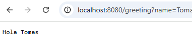
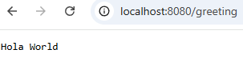
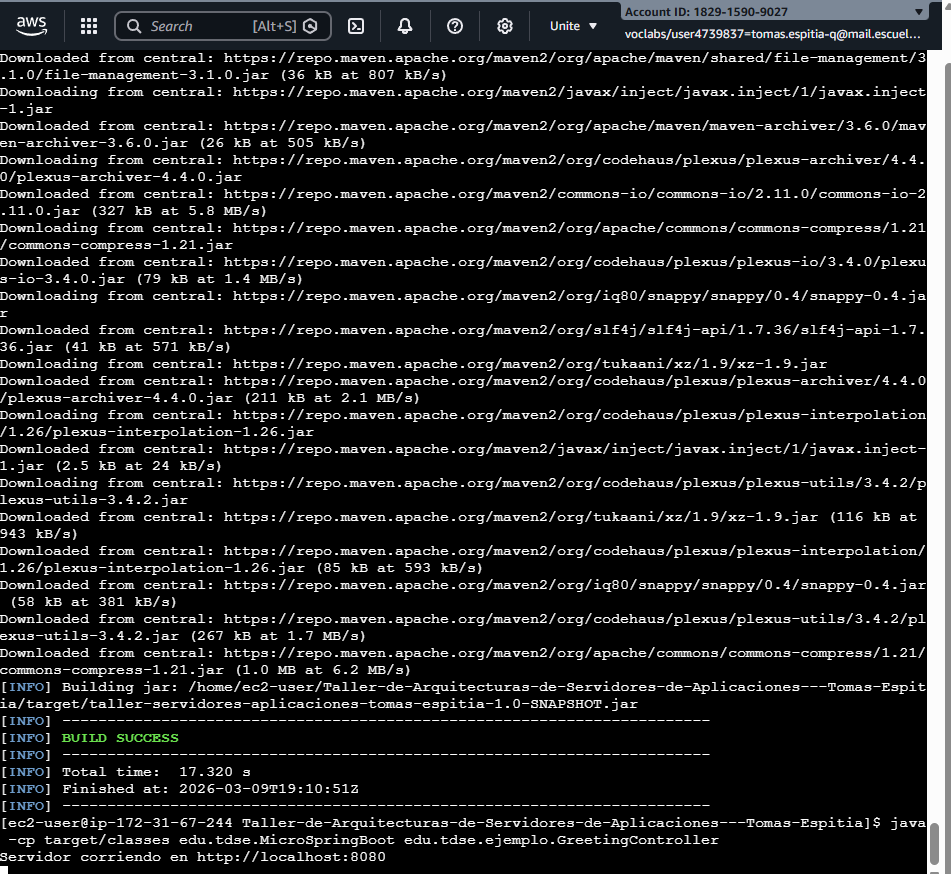

# Taller-de-Arquitecturas-de-Servidores-de-Aplicaciones---Tomas-Espitia

Este proyecto implementa un servidor web ligero desarrollado en Java capaz de servir páginas HTML e imágenes PNG, además de proporcionar un micro framework de Inversión de Control (IoC) para construir aplicaciones web a partir de POJOs (Plain Old Java Objects). El framework utiliza las capacidades reflexivas de Java para detectar clases anotadas con `@RestController`, mapear rutas HTTP mediante `@GetMapping` y manejar parámetros de consulta utilizando `@RequestParam`. El servidor procesa solicitudes HTTP de forma secuencial (no concurrente) y demuestra cómo es posible construir un pequeño framework web inspirado en Spring utilizando únicamente Java estándar, anotaciones y reflexión.

---

# Getting Started

Las siguientes instrucciones permiten obtener una copia del proyecto y ejecutarlo en una máquina local para desarrollo y pruebas. El proyecto se construye utilizando Maven y ejecuta un servidor HTTP ligero que expone endpoints REST definidos mediante anotaciones en clases POJO.

---

# Prerequisites

Para ejecutar este proyecto se requiere instalar las siguientes herramientas:

* **Java JDK 17**
* **Apache Maven**
* **Git**

### Instalación de Java

```
sudo dnf install java-17-amazon-corretto -y
```

Verificar instalación:

```
java -version
```

### Instalación de Maven

```
sudo dnf install maven -y
```

Verificar instalación:

```
mvn -version
```
---

# Installing

A continuación se muestran los pasos necesarios para preparar el entorno de desarrollo y ejecutar el servidor.

### Clonar el repositorio

```
git clone https://github.com/t0masespitia/Taller-de-Arquitecturas-de-Servidores-de-Aplicaciones---Tomas-Espitia.git
```

### Entrar al directorio del proyecto

```
cd Taller-de-Arquitecturas-de-Servidores-de-Aplicaciones---Tomas-Espitia
```

### Compilar el proyecto con Maven

```
mvn clean package
```

Este comando compila el código fuente y genera los archivos compilados dentro de la carpeta **target**.

### Ejecutar el servidor web

Para iniciar el servidor se debe ejecutar el framework indicando el controlador que se desea cargar:

```
java -cp target/classes edu.tdse.MicroSpringBoot edu.tdse.ejemplo.GreetingController
```

Si el servidor inicia correctamente se mostrará en consola:

```
Servidor corriendo en http://localhost:8080
```

### Probar la aplicación

Abrir el navegador y acceder a las siguientes rutas:

Página principal:

```
http://localhost:8080
```
Endpoint de saludo:
```
http://localhost:8080/greeting
```

Endpoint con parámetro:
```
http://localhost:8080/greeting?name=Tomas
```
Respuesta esperada:

```
Hola Tomas
```

´´´
# Running the tests

Actualmente el proyecto demuestra su funcionamiento mediante pruebas manuales accediendo a los endpoints del servidor.

### Pruebas End-to-End

Las pruebas end-to-end consisten en ejecutar el servidor y realizar solicitudes HTTP desde el navegador.

Ejemplo de prueba:

```
http://localhost:8080/greeting?name=World
```

Resultado esperado:

```
Hola World
```

Esto confirma que:

* El servidor HTTP recibe la solicitud correctamente.
* El framework identifica la ruta mediante la anotación `@GetMapping`.
* Java Reflection invoca dinámicamente el método correspondiente.
* El parámetro enviado en la URL es capturado mediante `@RequestParam`.

### Pruebas de estilo de código

El proyecto sigue convenciones estándar de Java:

* Organización por paquetes (annotations, http, example)
* Separación entre lógica del servidor y lógica de la aplicación
* Uso de anotaciones para definir controladores y rutas

Ejemplo de uso de anotaciones en el controlador:

```
@RestController
public class GreetingController {

    @GetMapping("/greeting")
    public String greeting(@RequestParam(value="name", defaultValue="World") String name) {
        return "Hola " + name;
    }
}
```

---

# Deployment

El servidor fue desplegado en una instancia AWS EC2 utilizando Amazon Linux.

Pasos realizados para el despliegue:

1. Crear una instancia EC2 en AWS.
2. Instalar Java 17, Maven y Git.
3. Clonar el repositorio del proyecto.
4. Compilar el proyecto usando Maven.
5. Ejecutar el servidor web desde la instancia.

Comando ejecutado en la instancia EC2:

```
java -cp target/classes edu.tdse.MicroSpringBoot edu.tdse.ejemplo.GreetingController
```

El servidor quedó disponible mediante la dirección pública de la instancia:

```
http://13.222.109.49:8080
```

Endpoints disponibles:

```
http://13.222.109.49:8080
http://13.222.109.49:8080/greeting
http://13.222.109.49:8080/greeting?name=Tomas
```

---

# Built With

* **Java** – Lenguaje utilizado para desarrollar el servidor y el framework.
* **Maven** – Herramienta para la gestión de dependencias y ciclo de vida del proyecto.
* **Java Reflection API** – Utilizada para detectar e invocar dinámicamente métodos anotados.
* **AWS EC2** – Plataforma utilizada para el despliegue del servidor.

---

# Authors

**Tomás Espitia**
